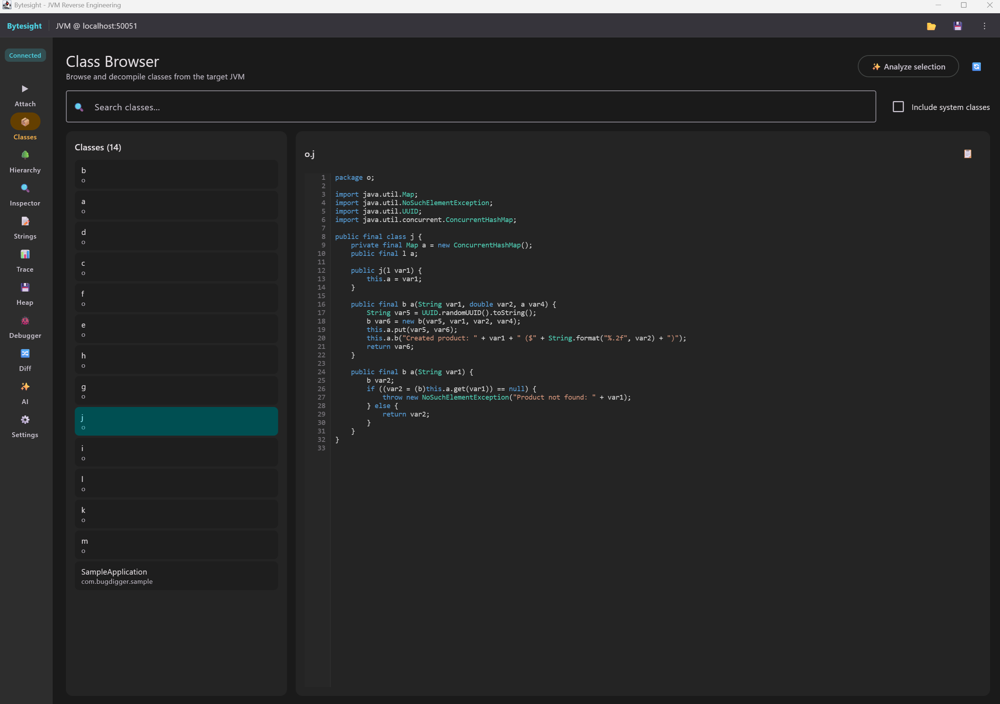
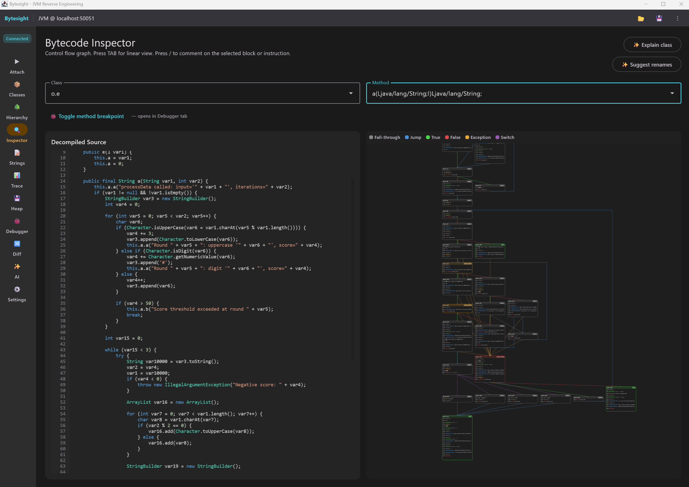

<p align="center">
  
</p>

<h1 align="center">Bytesight</h1>

<p align="center"><em>JVM reverse-engineering studio — attach, inspect, rename, diff.</em></p>

---

## What is Bytesight?

Bytesight is a desktop reverse-engineering tool for the JVM. It attaches a Java agent to a running process — or loads a `.jar`, `.apk`, or saved `.bts` project off disk — and lets you browse loaded classes, decompile them with Vineflower, walk inheritance trees, hunt for hardcoded strings, trace live method calls, capture heap snapshots, set breakpoints, and rename obfuscated symbols (with renames applied at the bytecode layer so they cascade through every call site, type reference, and decompiled view). A built-in AI agent has tool access to all of the above so you can ask natural-language questions about the target.

The point is a tight loop: decompile → annotate → cross-reference → repeat — without leaving the app or losing context.

## Screenshots

<p align="center">
  
</p>
<p align="center"><em>Class Browser — list of loaded classes, decompiled source on the right.</em></p>

<p align="center">
  
</p>
<p align="center"><em>Inspector — disassembly + decompiled side by side with the control-flow graph.</em></p>

---

## Features

- **Multi-source attach.** Live JVM via the Attach API, static `.jar` / `.apk` from disk, or `.bts` project files saved from prior sessions.
- **Decompiler integration.** Vineflower (Fernflower fork) renders Java-like source for any selected class. Renames are applied at the **bytecode layer** via ASM `ClassRemapper` before decompilation, so two fields named `a` of different types stay distinct.
- **Persistent project files.** A `.bts` is a self-contained ZIP — every class's bytecode plus your renames, comments, breakpoints, and settings. Reopens forever, even after the original process is gone.
- **Bytecode diff.** Compare two `.bts` or `.jar` files; multi-feature heuristic (opcode histogram + callee Jaccard + signature + string Jaccard) ranks method matches by confidence; transfer renames from old → new.
- **Live tracing.** ByteBuddy-based method hooks stream entry/exit events with arguments and return values over gRPC.
- **Heap inspection.** JVMTI-driven snapshot with class histogram, instance walking, value search, and duplicate-string detection.
- **Source-level debugger.** Breakpoints (line, method, conditional, hit-count), stepping (over / into / out), call-stack with frame variables, and recordable / replayable `.btsrec` traces.
- **Cross-references.** Press **X** in Inspector → popup of every place the selected method is invoked + every place the surrounding class is referenced. IDA-style.
- **Symbol renaming with disambiguation.** Same-named symbols (the JVM-legal pattern obfuscators love) are disambiguated via a precise key including the descriptor.
- **Built-in AI agent.** A Koog-driven LLM agent with tool access to the live target — list classes, decompile, search strings, read traces, query the heap, and apply renames in bulk.

## Tabs at a glance

| Tab | What it does |
|---|---|
| **Attach** ▶ | Discover running JVMs and attach the Bytesight agent, *or* load a `.jar` / `.apk` for static-only analysis. |
| **Classes** 📦 | Browse every class the active source knows about; click one to see its decompiled Java-like source. |
| **Hierarchy** 🌳 | Inheritance tree across all loaded classes — extends + implements. |
| **Inspector** 🔍 | Bytecode disassembly (linear or control-flow-graph view), decompiled source, gutter breakpoints, instruction comments, symbol renaming with disambiguation, and **X**-key cross-references. |
| **Strings** 📝 | Extract every hardcoded string / numeric constant from loaded classes. Filter by URL, IP, crypto key, SQL, etc. |
| **Trace** 📊 | Add method hooks; stream entry/exit events live with arguments, return values, durations, and call depth. |
| **Heap** 💾 | Capture a heap snapshot, browse the class histogram, walk individual instances, search by field value, find duplicate strings. |
| **Debugger** 🐞 | Set breakpoints (line / method / conditional / hit-count), step in/out/over, view stack frames + locals + `this`, record sessions to `.btsrec` for replay. |
| **Diff** 🔀 | Load two projects side by side; ranked method-pair list with per-feature score breakdown; transfer renames from one side to the other. |
| **AI** ✨ | Chat with an LLM agent that can call Bytesight's tools (see below). |
| **Settings** ⚙ | API keys, decompiler options, agent ports. |

The Sidebar disables tabs based on the active source's capability set: `.jar` / `.apk` / `.bts` files only enable static tabs (Classes, Hierarchy, Inspector, Strings); live attach enables everything.

## AI agent tools

The Bytesight AI agent (powered by JetBrains [Koog](https://github.com/JetBrains/koog)) has access to the following tools, each of which calls into the same services the rest of the UI uses:

| Tool | Purpose |
|---|---|
| `list_classes` | List loaded classes in the target, with substring filtering. |
| `decompile_class` | Decompile one class to Java-like source (renames already applied). |
| `decompile_classes` | Decompile up to several classes at once for cross-reference analysis. |
| `get_class_info` | Structural shape of a class — super, interfaces, methods, fields. Cheaper than decompiling. |
| `search_strings` | Find string constants across all loaded classes (great for crypto keys, URLs, SQL, log messages). |
| `get_recent_traces` | Read the most recent method-trace events captured by the active hooks. |
| `get_heap_histogram` | Read class-level heap usage from the most recent snapshot. |
| `rename_symbol` | Apply a single rename. |
| `batch_rename` | Apply many renames at once, e.g. after the agent finishes analyzing a class. |
| `get_renames` | List every rename currently applied. |

Configure the LLM provider and API key under **Settings**.

---

## Build and run the desktop app

To build and run the development version, use the run configuration in your IDE's run widget, or run from the terminal:

- macOS / Linux:
  ```shell
  ./gradlew :composeApp:run
  ```
- Windows:
  ```shell
  .\gradlew.bat :composeApp:run
  ```

## Sample target app (for obfuscation testing)

A sample JVM application is included to test attaching, tracing, debugging, and obfuscation workflows.

Build the normal sample JAR:
```shell
./gradlew :sample:jar
```

Build an obfuscated version with ProGuard:
```shell
./gradlew :sample:obfuscate
```

Run the normal version (baseline):
```shell
./gradlew :sample:run
```

Run the obfuscated version:
```shell
./gradlew :sample:runObfuscated
```

Or run a built JAR directly:
```shell
java -jar sample/build/libs/sample-0.1.0-SNAPSHOT.jar           # Normal
java -jar sample/build/obfuscated/sample-obfuscated.jar         # Obfuscated
```

### Output files

After `./gradlew :sample:obfuscate`:

| File | Description |
|---|---|
| `sample/build/obfuscated/sample-obfuscated.jar` | The obfuscated JAR |
| `sample/build/obfuscated/mapping.txt` | ProGuard mapping file (original → obfuscated names) |
| `sample/build/obfuscated/proguard.pro` | Generated ProGuard configuration |

### Obfuscation details

The ProGuard configuration applies aggressive obfuscation:
- **Class renaming** — every class except `SampleApplication` is renamed to short names (`a`, `b`, `c`, …).
- **Package flattening** — all packages are merged into `o/`.
- **Method renaming** — every method is renamed.
- **Optimization** — three passes.
- **Shrinking** — unused code removed.

---

## Architecture pointers

- [`AGENTS.md`](AGENTS.md) — coding conventions, module layout, build/test commands.
- [`CLAUDE.md`](CLAUDE.md) — Claude Code project guidance.
- [`devdocs/`](devdocs/) — feature design notes (`multi-source-*.md`, `debugger.md`, `heap-testing-guide.md`, etc.).
